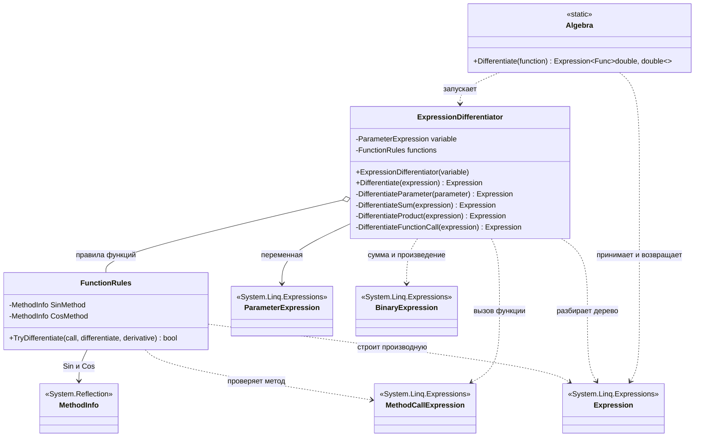

# Практика «Дифференцирование»

## Описание предметной области и сущностей

В этой задаче функция представлена как дерево LINQ Expressions. Нужно построить новое выражение, которое соответствует производной исходной функции.

Algebra - точка входа. Получает лямбда-выражение, берет из него параметр и запускает дифференцирование.

ExpressionDifferentiator - основной обходчик выражения. Он разбирает константы, параметр, сложение, умножение и вызовы функций.

FunctionRules - отдельный класс с правилами для поддерживаемых математических функций. Сейчас в нем есть правила для Sin и Cos.

Expression - базовый тип узла дерева выражения из System.Linq.Expressions.  
ParameterExpression - переменная, по которой идет дифференцирование.  
BinaryExpression - узел для сложения и умножения.  
MethodCallExpression - узел вызова функции, например Math.Sin или Math.Cos.

