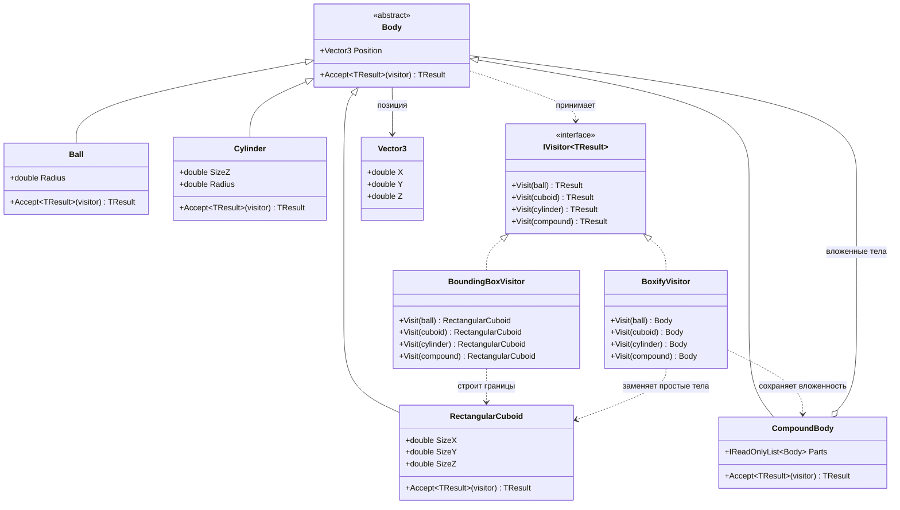

# Практика: Геометрия-2

## Описание предметной области и сущностей

Body - общий абстрактный класс для всех тел.  
Ball, RectangularCuboid, Cylinder и CompoundBody - конкретные виды тел  
CompoundBody хранит набор вложенных тел
IVisitor<TResult> задает методы посещения для каждого типа фигуры  
BoundingBoxVisitor вычисляет минимальный ограничивающий параллелепипед  
BoxifyVisitor заменяет простые тела на параллелепипеды, а структуру составных тел сохраняет

