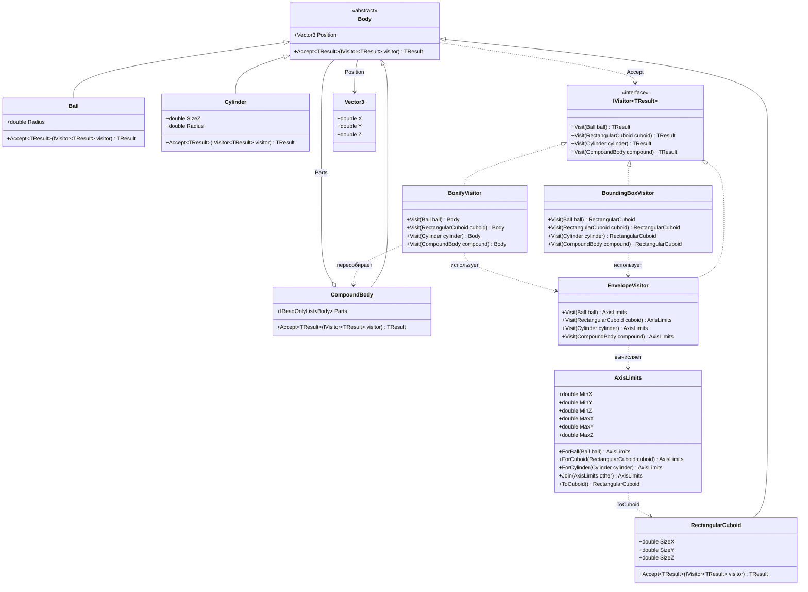

# Практика «Геометрия-2»

## Описание предметной области и сущностей

отличия от прошлой версии решения: фигуры остаются простыми объектами с параметрами и методом Accept. Операции над ними вынесены в visitor-классы

Body - базовый абстрактный тип для всех геометрических тел, хранит позицию в пространстве
Ball - шар, задаётся радиусом
Cylinder - цилиндр с радиусом основания и высотой  
RectangularCuboid - прямоугольный параллелепипед с размерами по трём осям  
CompoundBody - составное тело, хранит список вложенных тел  
Vector3 - структура для хранения координат точки в трёхмерном пространстве
IVisitor<TResult> - обобщённый интерфейс операции над телами, позволяет добавлять новые операции без изменения иерархии фигур  
AxisLimits - вспомогательный класс, инкапсулирующий минимальные и максимальные координаты по осям X, Y, Z.  
EnvelopeVisitor - посетитель, вычисляющий координатные границы тела в виде AxisLimits 
BoundingBoxVisitor - посетитель, строящий итоговый ограничивающий параллелепипед через делегирование EnvelopeVisitor
BoxifyVisitor - посетитель, заменяющий простые тела на их ограничивающие параллелепипеды, а составные тела пересобирающий из преобразованных частей

