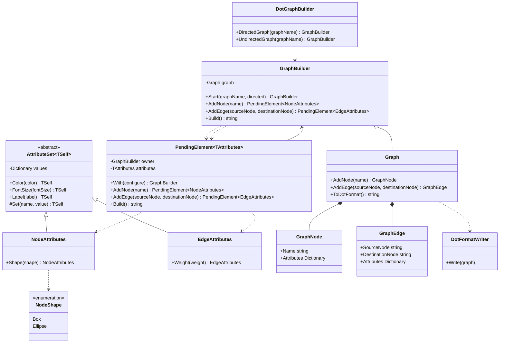

# Практика: GraphViz

## Описание предметной области и сущностей

В задаче сделан fluent API для сборки графа в формате DOT. Хранение графа и вывод строки не переписываются заново: для этого используются готовые классы Graph, GraphNode, GraphEdge и DotFormatWriter

DotGraphBuilder - точка входа. Создает направленный или ненаправленный граф

GraphBuilder - основной объект цепочки. Он хранит Graph, добавляет вершины и ребра, а в конце возвращает DOT-строку через Build

PendingElement<TAttributes> - промежуточный шаг после добавления вершины или ребра. Через него можно либо настроить текущий элемент методом With, либо сразу продолжить цепочку

AttributeSet<TSelf> - общий базовый класс для общих атрибутов color, fontsize и label

NodeAttributes - набор атрибутов вершины. Дополнительно поддерживает shape

EdgeAttributes - набор атрибутов ребра. Дополнительно поддерживает weight

NodeShape - перечисление доступных форм вершины

