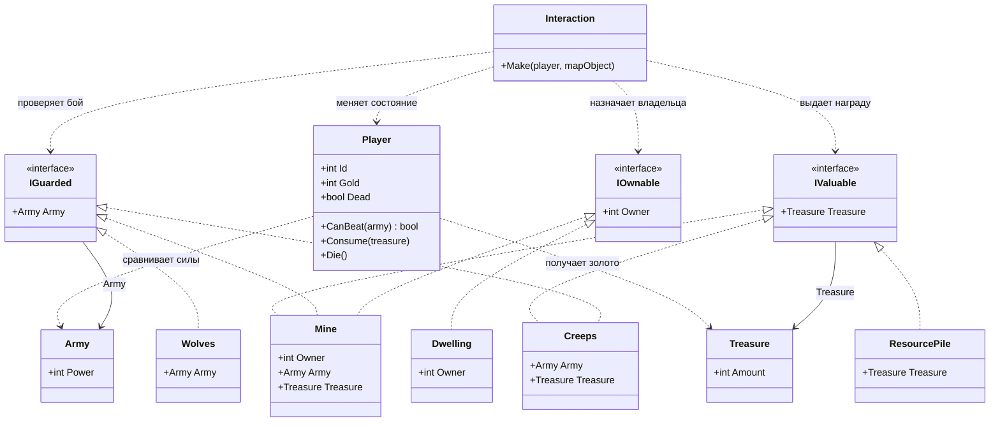

# Практика «HoMM»

## Описание предметной области и сущностей

В игре есть объекты карты, с которыми взаимодействует игрок. Разные объекты могут обладать разными возможностями: иметь владельца, охраняться армией или содержать сокровища

Player описывает игрока. Он может проверять, способен ли победить армию, получать сокровища и погибать при неудачном сражении

IOwnable выделяет объекты, которые можно присвоить игроку

IGuarded выделяет объекты, перед которыми нужно сначала пройти бой

IValuable выделяет объекты, из которых можно получить сокровища

Interaction выполняет взаимодействие через интерфейсы, не зная конкретный тип объекта карты

