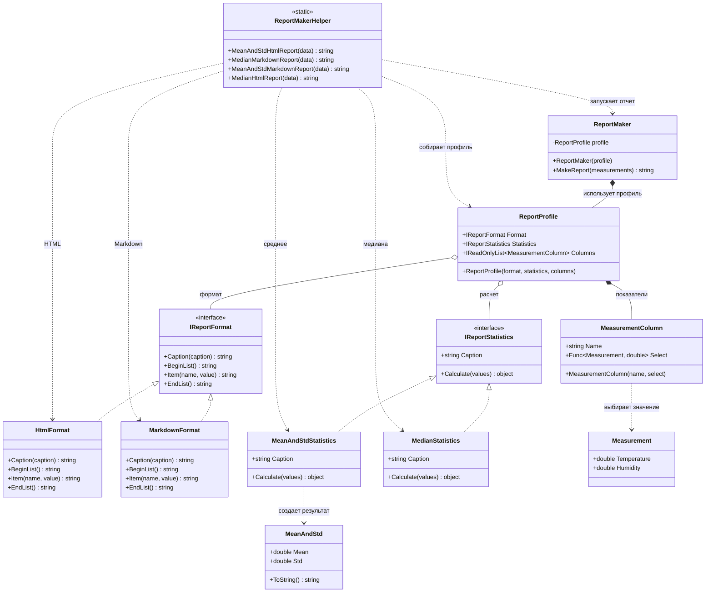

# Практика: Генератора отчетов

## Описание предметной области и сущностей

отчет разделен на несколько простых частей. формат отвечает за внешний вид, статистика отвечает за расчет значения, а профиль отчета собирает эти части вместе

ReportMaker - основной класс, который строит отчет по готовому профилю  
ReportProfile - настройки отчета: формат, способ расчета и список показателей  
MeasurementColumn - описание одного показателя, например температуры или влажности  
IReportFormat - интерфейс оформления отчета  
HtmlFormat - оформление отчета в HTML  
MarkdownFormat - оформление отчета в Markdown  
IReportStatistics - интерфейс вычисления статистики  
MeanAndStdStatistics - считает среднее и стандартное отклонение  
MedianStatistics - считает медиану  
ReportMakerHelper - статический класс с готовыми методами для четырех нужных вариантов отчета

