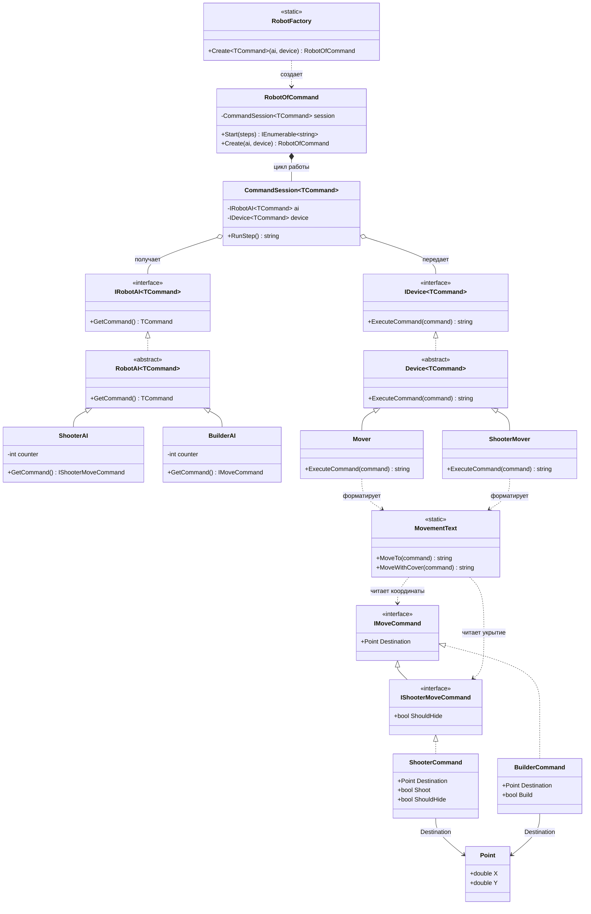

# Практика: Роботы

## Описание предметной области и сущностей

В решении робот разделен на три слоя. AI создает команду, Device выполняет команду, а CommandSession связывает эти две части на один шаг работы

IRobotAI<TCommand> - ковариантный источник команд
IDevice<TCommand> - контравариантный исполнитель команд  
RobotAI<TCommand> - базовый класс для генераторов команд  
Device<TCommand> -базовый класс для устройств 
CommandSession<TCommand> - объект, который получает команду от AI и сразу передает ее устройству  
RobotOfCommand на диаграмме соответствует классу Robot<TCommand> в коде 
RobotFactory на диаграмме соответствует статическому классу Robot в коде
MovementText - отдельный formatter строк движения

