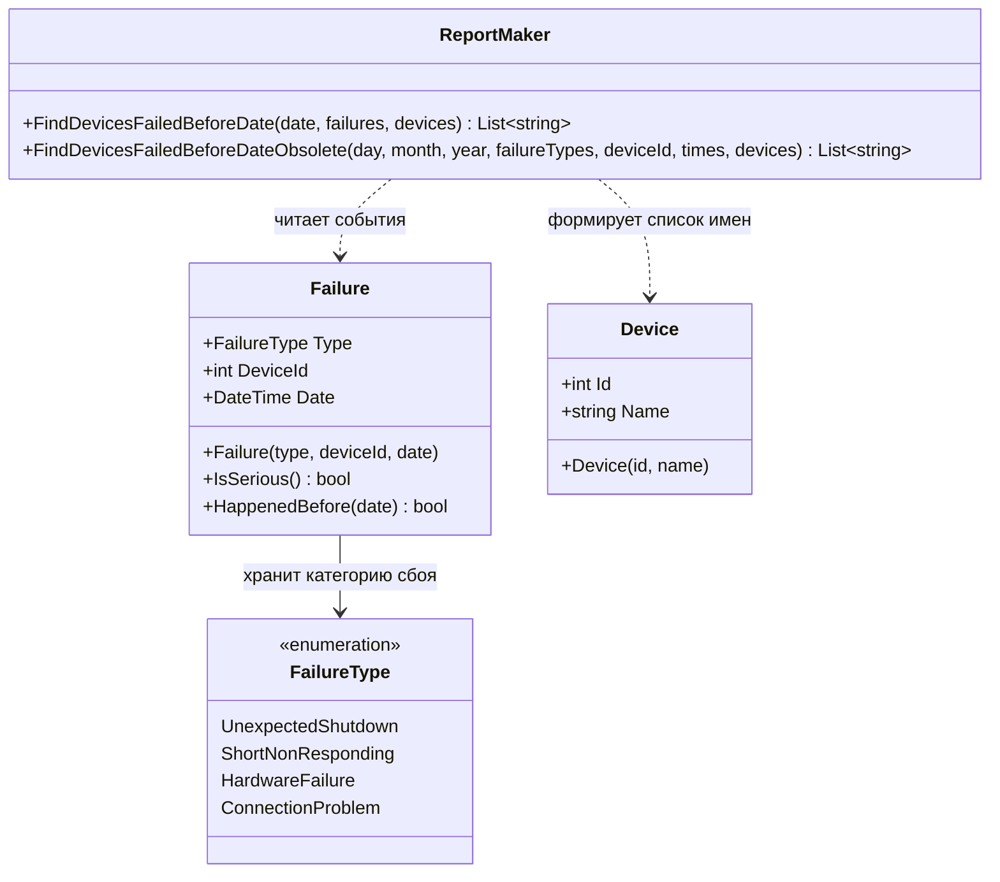

# Практика Сбои
## Описание предметной области и сущностей

В системе обрабатываются сведения об устройствах и событиях сбоев, которые были зафиксированы для этих устройств. Цель отчета - найти устройства, у которых до заданной даты произошел серьезный сбой

1. Device -сущность устройства. Хранит идентификатор Id и название Name которое затем попадает в итоговый отчет

2. Failure - сущность сбоя. Хранит тип сбоя Type, идентификатор связанного устройства DeviceId и дату события Date. Также содержит методы IsSerious() и HappenedBefore(..) чтобы проверка сбоя не была размазана по коду отчета

3. FailureType - перечисление возможных типов сбоев: UnexpectedShutdown, ShortNonResponding, HardwareFailure, ConnectionProblem. Оно заменяет числовые коды из исходного варианта программы

4. ReportMaker - класс формирования отчета. Получает коллекции устройств и сбоев, выбирает серьезные сбои раньше заданной даты и возвращает имена устройств, подходящих под это условие

