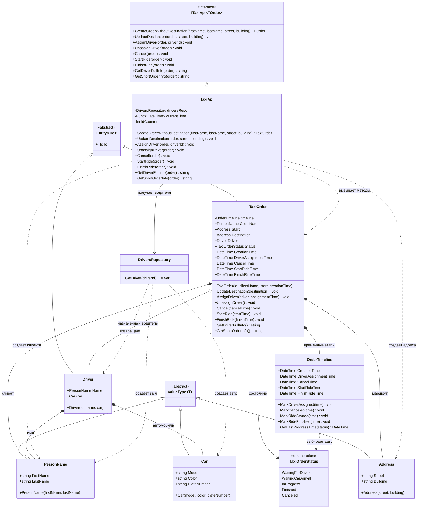

# Практика: TaxiOrder

## Описание предметной области и сущностей

В этой версии заказ такси сделан как доменная модель. Основная логика переходов между состояниями перенесена в TaxiOrder, а TaxiApi только создает нужные объекты и вызывает методы заказа

TaxiOrder - основная сущность заказа. В ней хранятся клиент, адрес отправления, адрес назначения, водитель, статус и методы управления заказом

OrderTimeline - отдельный объект для временных отметок заказа: создание, назначение водителя, начало поездки, завершение и отмена

Driver - сущность водителя. Содержит имя водителя и данные автомобиля.

Car - объект-значение с данными автомобиля.

PersonName - объект-значение для имени и фамилии.

Address - объект-значение для адреса.

DriversRepository - репозиторий, который по id возвращает водителя и не работает с заказами.

TaxiApi - внешний слой, который сохраняет старый публичный интерфейс и делегирует действия TaxiOrder.

